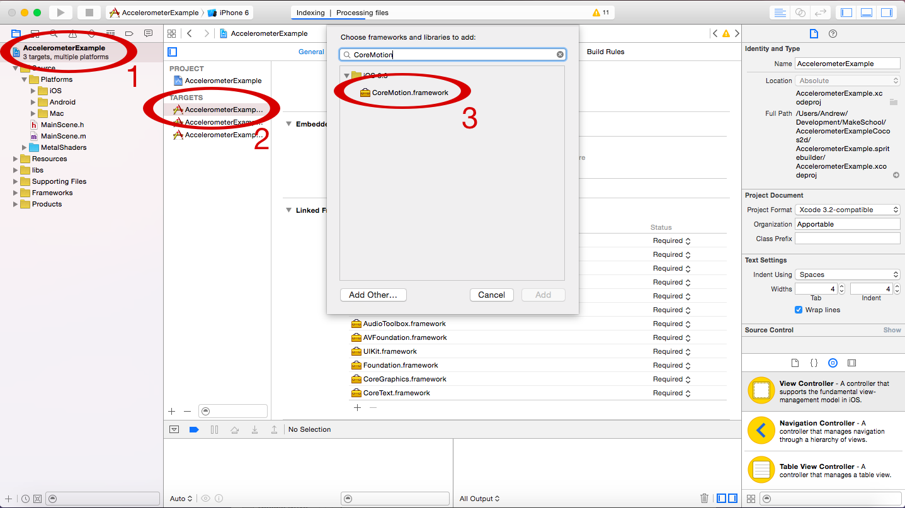

---
title: Accelerometer with Cocos2D
slug: accelerometer-cocos2d
gamernews_id: 371
---            

This brief tutorial will give you a minimalistic example of how to use the accelerometer to move nodes in Cococs2d 3.4. We are going to use *CMMotionManager* which replaces the older *UIAccelerometerDelegate.* 

Before we start you can either create a new SpriteBuilder project or proceed and add the code to an existing project of yours.

# Include the CoreMotion framework

As a first step you need to add the CoreMotion framework to your project:

First you need to select your project in the left file browser (1). Then you need to select your app target in the middle pane (2). Next, click the small + button in the *Link Binary With Libraries* section. In the dialog that appears now you need to select *CoreMotion.framework* (3). Now the framework is added to your project.

# Include the CoreMotion header

Open the *.m* file of the class where you want to add the accelerometer handling. At the top of the file include this import statement:

    #import <CoreMotion/CoreMotion.h>

This will make the CoreMotion classes available in this *.m* file.

# Set a CMMotionManager up

The *CMMotionManager* is a class that provides access to all motion data that is collected by the mobile device - including the accelerometer data. You need to create an instance of this *CMMotionManager* in your app. It is important to know that you should only have on instance in your entire app. If you need to access the *CMMotionManager* from multiple classes, you should setup some sort of shared instance that holds a reference to this one *CMMotionManager*.

For now we will keep it simple and create one *CMMotionManager* in the scene or node we want to use it from.

# Store Screen Size

To help us position the label we're using, and keep it on screen, we'll use the class *CCDirector* to give us some information on the size of the phone screen.  *CCDirector* is a class that handles the main view, presents scenes, and handles all the updates and drawing.  *CCDirector* has a property that describes the height and width of the current device.  We'll store that property for use later.

Add a private instance variable to your *.m* file, also add a variable for a label which we will be moving using the accelerometer data, and a variable for the screen size:

    @implementation MainScene {
        // important: only create one instance of a motion manager
        CMMotionManager *_motionManager;
        CCLabelTTF *_label;
        CGSize _screen;
    }

Instantiate the motion manager, the label, and screen size variable in the *didLoadFromCCB* method of your class:

    - (void)didLoadFromCCB
    {
        _label= [CCLabelTTF labelWithString:@"X" fontName:@"ArialMT" fontSize:48];
        [self addChild:_label];
        _motionManager = [[CMMotionManager alloc] init];
        _screen = [CCDirector sharedDirector].viewSize;
    }

Next, let's start capturing accelerometer events.

# Start accelerometer updates

After instantiating a *CMMotionManager* you still need to manually start and stop the recording of accelerometer events. Good methods to do this are *onEnter* and *onExit* because you (mostly) only want to track accelerometer updates when the scene that uses them is visible.

Add these two methods to your class:

    - (void)onEnter
    {
        [super onEnter];
        _label.position = ccp(_screen.width/2, _screen.height/2);
        [_motionManager startAccelerometerUpdates];
    }
    - (void)onExit
    {
        [super onExit];
        [_motionManager stopAccelerometerUpdates];
    }

We also use the *onEnter* method to center our label on the screen.  

# Use the accelerometer data

Basically there are two different ways to access the accelerometer data. One is using the [startAccelerometerUpdatesToQueue:withHandler:](https://developer.apple.com/library/ios/documentation/coremotion/reference/cmmotionmanager_class/Reference/Reference.html#//apple_ref/occ/instm/CMMotionManager/startAccelerometerUpdatesToQueue:withHandler:) method. That method allows you to start the accelerometer updates and set up a block that will be called at a predefined interval and receives the new accelerometer data.

The other option that we will be using, because it is more suitable for moving a node in Cocos2d, is calling the *startAccelerometerUpdates* method (which we already did) and accessing the data through the *accelerometerData* property of the *CMMotionManager*.

We will access the data in the *update* method of our scene, because this is the place where we will implement the movement of the node. Add the *udpate* method to your scene:

    - (void)update:(CCTime)delta {
        CMAccelerometerData *accelerometerData = _motionManager.accelerometerData;
        CMAcceleration acceleration = accelerometerData.acceleration;
        CGFloat newXPosition = _label.position.x + acceleration.y * 1000 * delta;
        newXPosition = clampf(newXPosition, 0, _screen.width);
        _label.position = CGPointMake(newXPosition, _label.position.y);
    }

The code above is fairly simple. We access the *accelerometerData* which gives us access to the *acceleration*. We modify the position of the label relative to the acceleration and limit the position within the left and right boundary of the scene.

**Well done!** Now you know how to use the Accelerometer within your games. When you run the app on your device you should be able to move the "X" across the screen by tilting it.

# Sample project on GitHub

You can find the sample project for this tutorial on [Github](https://github.com/MakeGamesWithUs/AccelerometerExampleCocos2d).

Happy Coding!

benji@makeschool.com
